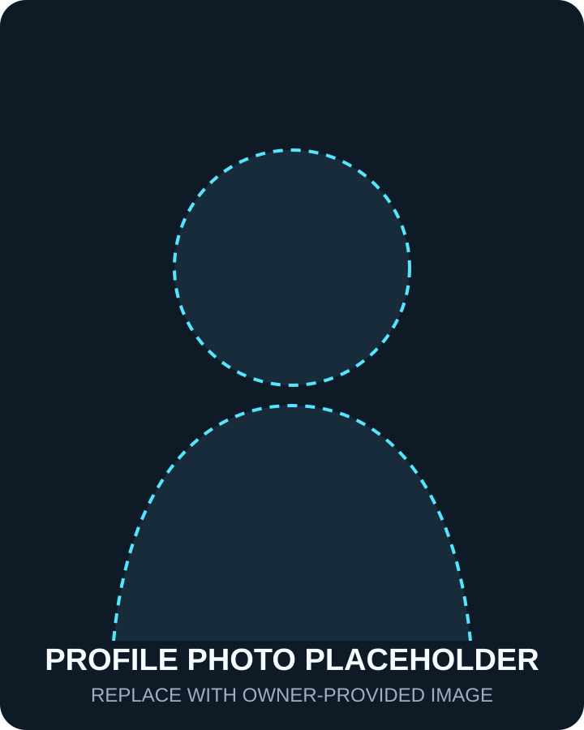

# About KOPE SOLUTION

**KOPE SOLUTION** เป็นพื้นที่สำหรับแบ่งปันความรู้เชิงปฏิบัติ การทดลอง ประสบการณ์ระหว่างการพัฒนา และบทเรียนจากโครงการเทคโนโลยีในโลกจริง เนื้อหาตั้งใจเชื่อมหลักการเข้ากับกระบวนการลงมือทำ พร้อมแยกสิ่งที่พิสูจน์แล้ว สิ่งที่กำลังทดลอง และสิ่งที่ยังต้องศึกษาออกจากกันอย่างชัดเจน

## Brand direction

  
<h3>Keen</h3>
ใส่ใจรายละเอียดและพัฒนาความเข้าใจให้ลึกขึ้น

  
<h3>Observe</h3>
สังเกตระบบ ข้อมูล และข้อจำกัดก่อนตัดสินใจ

  
<h3>Pioneer</h3>
กล้าสำรวจแนวทางใหม่อย่างมีเหตุผลและตรวจสอบได้

  
<h3>Empower</h3>
เปลี่ยนความรู้ให้ผู้อื่นนำไปต่อยอดได้

> **CONTRIBUTE — สร้างประโยชน์ต่อสังคม**

## Creator profile — โก๊ป

  

    โปรไฟล์รอข้อมูลจริง
    <h2>โก๊ป</h2>
    
<strong>Short biography:</strong> [PLACEHOLDER — เจ้าของเว็บไซต์เพิ่มประวัติย่อที่ตรวจสอบแล้ว โดยไม่ใส่ข้อมูลลูกค้า นายจ้าง การศึกษา หรือผลงานที่ยังไม่ได้รับอนุญาต]

    
<strong>Experience summary:</strong> [PLACEHOLDER — สรุปประสบการณ์จริง]

    
<strong>Work philosophy:</strong> [PLACEHOLDER — เพิ่มแนวคิดการทำงานของเจ้าของเว็บไซต์]

  

  

## Skills and areas of interest

รายการต่อไปนี้เป็น **ขอบเขตหัวข้อของเว็บไซต์** ไม่ใช่การรับรองระดับความเชี่ยวชาญหรือประวัติการทำงาน

- **Software & Data:** Software Engineering, Python, Rust, C and C++, Data Engineering, Data Visualization, Artificial Intelligence, Computer Vision
- **Embedded & Electronics:** Embedded Systems, Electronics, Microcontrollers, Arduino, AVR Bare-Metal C, ESP32, ESP-IDF, STM32, PCB Design
- **Sensors & Industry:** Sensors and Measurement, Industrial IoT, AIoT, IIoT, Industrial Systems, Smart Farm
- **Connectivity:** MQTT, Modbus, RS-485, Communication Protocols, Network
- **Architecture:** Edge Computing, Gateway Systems และการออกแบบ data flow

### Skills

[PLACEHOLDER — ระบุทักษะจริง ระดับความถนัด และเครื่องมือที่ใช้งานได้]

### Areas of interest

[PLACEHOLDER — ระบุหัวข้อที่สนใจจริงและกำลังศึกษา]

### Experience summary

[PLACEHOLDER — เพิ่มช่วงประสบการณ์ บทบาท และขอบเขตงานที่เปิดเผยได้ หลีกเลี่ยงข้อมูลลูกค้าหรือองค์กรที่ไม่ได้รับอนุญาต]

### Work philosophy

[PLACEHOLDER — เพิ่มหลักการทำงาน การทดลอง การบันทึกผล และการแบ่งปันความรู้]

### Contact channels

Email, Facebook, YouTube และ GitHub ได้รับการยืนยันแล้ว ส่วน LINE Official Account และ Marketplace ยังเป็น placeholder ดูรายละเอียดในหน้า [Contact](../contact/index.md)

## Brand assets

- Primary horizontal logo for light backgrounds: `docs/assets/images/kope-solution-logo-2027.png`
- Light horizontal logo for dark backgrounds: `docs/assets/images/kope-solution-logo-2027-light.png`
- Square brand mark and favicon: `docs/assets/images/kope-solution-mark-2027.png`
- Profile photograph: `docs/assets/images/profile-placeholder.svg`
- Open Graph / social image: `docs/assets/images/social-placeholder.svg`

โลโก้ Version 2027 ใช้สีดำ ขาว แดง และน้ำเงิน โดยออกแบบเส้นวงจรด้านบน–ล่างให้เป็น geometry แบบ mirror และจัดซ้าย–ขวาให้สมดุลด้วย stroke และ node ที่สม่ำเสมอ ไฟล์รุ่นก่อนยังถูกเก็บไว้สำหรับย้อนกลับ ส่วนภาพโปรไฟล์และ social image ยังคงเป็น placeholder

