# ประวัติไมโครคอนโทรลเลอร์: 16 ตระกูลสำคัญจากยุคแรกสู่ Wireless SoC

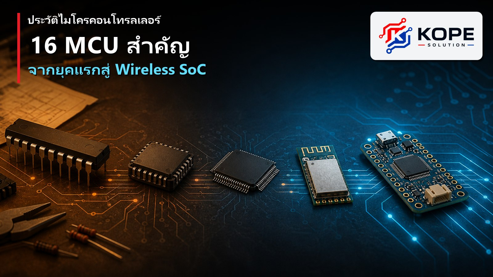

*ภาพประกอบเชิงแนวคิดสร้างขึ้นสำหรับ KOPE SOLUTION ไม่ใช่ภาพผลิตภัณฑ์หรือสัดส่วนอ้างอิงทางวิศวกรรม*

*ชื่อบริษัทและชื่อผลิตภัณฑ์เป็นเครื่องหมายการค้าของเจ้าของแต่ละราย ใช้ในบริบทเชิงบรรณาธิการเพื่อระบุผู้ผลิตเท่านั้น ไม่ได้สื่อถึงการรับรอง การสนับสนุน หรือความร่วมมือกับ KOPE SOLUTION ภาพชุดนี้ไม่ใช้โลโก้ผู้ผลิตเมื่อไม่มีสิทธิ์ใช้งานที่ชัดเจน*

ไมโครคอนโทรลเลอร์หรือ MCU คือคอมพิวเตอร์ขนาดเล็กที่รวม CPU, memory และวงจรเชื่อมต่อฮาร์ดแวร์ไว้ในชิปเดียว เราพบมันได้ในรถยนต์ เครื่องใช้ไฟฟ้า ระบบโรงงาน เครื่องมือวัด อุปกรณ์ทางการแพทย์ ของเล่น และอุปกรณ์ IoT แม้ผู้ใช้งานปลายทางแทบไม่เคยเห็นตัวชิปก็ตาม

บทความนี้เลือก MCU 16 ตระกูลหรือรุ่นที่ช่วยอธิบายจุดเปลี่ยนสำคัญของวงการ ตั้งแต่การรวม CPU, memory และ I/O เข้าสู่ชิปเดียว การใช้ register file และ Flash ที่เขียนซ้ำได้ การเปลี่ยนผ่านสู่ 32-bit ไปจนถึง Bluetooth LE, Wi-Fi, dual-core และการเติบโตของผู้ผลิตจากหลายภูมิภาค

!!! note "นี่ไม่ใช่อันดับ 1–16"
    คำว่า “สำคัญ” ในบทความนี้หมายถึงเป็นตัวแทนของพัฒนาการในแต่ละช่วงเวลา ไม่ได้หมายความว่าเป็นรายชื่อ MCU ที่ดีที่สุดหรือขายดีที่สุดอย่างเป็นทางการ รายชื่อยังสามารถขยายต่อได้อีก เช่น Motorola 6805, Intel 8096, Infineon C166/AURIX, Silicon Labs EFM32, NXP Kinetis/i.MX RT, RISC-V MCU และตระกูลสำหรับยานยนต์อีกจำนวนมาก

## สรุปเส้นเวลา

| ช่วงเวลา | MCU หรือตระกูล | สถาปัตยกรรม | จุดสำคัญที่ใช้เล่าเรื่อง |
|---|---|---|---|
| 1971–1974 | TI MCU ยุคแรก / TMS1000 | 4-bit | แนวคิดคอมพิวเตอร์ควบคุมบนชิปเดียว |
| 1976 | Intel MCS-48 / 8048 | 8-bit | MCU เชิงพาณิชย์ยุคแรกที่ใช้งานแพร่หลาย |
| 1979 | Zilog Z8 | 8-bit Z8 | register file และอุปกรณ์ต่อพ่วงในชิปเดียว |
| 1980 | Intel 8051 / MCS-51 | 8-bit MCS-51 | สถาปัตยกรรมที่แพร่หลายและอยู่ได้นาน |
| กลางทศวรรษ 1980 | Motorola 68HC11 | 8-bit | timer, serial และ analog สำหรับงานควบคุม |
| 1992 | TI MSP430 family | 16-bit RISC | การออกแบบที่ให้ความสำคัญกับพลังงานต่ำ |
| ปลายทศวรรษ 1990 | PIC16F84A | 8-bit PIC RISC | Flash/EEPROM และการทดลองเขียนโปรแกรมซ้ำ |
| 1996–1997 | Atmel AVR รุ่นแรก | 8-bit AVR RISC | 32 working registers และการทำงานแบบ single-cycle จำนวนมาก |
| ราว 2005 | Philips LPC2148 | 32-bit Arm7TDMI-S | การเปลี่ยนผ่านสู่ Arm 32-bit และ USB |
| 2007 | STM32F103 | 32-bit Arm Cortex-M3 | Cortex-M และ ecosystem ของ MCU 32-bit |
| 2009–2010 | ATmega328/328P บน Arduino | 8-bit AVR | เครื่องมือ ซอฟต์แวร์ และชุมชน Maker |
| 2010–2011 | Renesas RL78 | 16-bit CISC | รวมสาย 78K และ R8C พร้อมเน้นพลังงานต่ำ |
| 2012–2015 | Nordic nRF51 / nRF52 | Arm Cortex-M0/M4F | Bluetooth LE แบบ wireless SoC |
| 2016 | Espressif ESP32 | 32-bit Xtensa LX6 | Wi-Fi และ Bluetooth ใน MCU ราคาประหยัด |
| 2021 | Raspberry Pi RP2040 | dual-core Arm Cortex-M0+ | dual-core, SRAM ขนาดใหญ่ และ PIO |
| 2022 | Nations N32G430 / N32 family | 32-bit Arm Cortex-M4F | MCU สมรรถนะสูงจากผู้ผลิตจีนและตัวเลือก supply chain ใหม่ |

ปีในตารางมีทั้ง “ปีเปิดตัวตระกูล” และ “ช่วงที่รุ่นตัวอย่างได้รับความนิยม” จึงต้องอ่านร่วมกับคำอธิบายของแต่ละหัวข้อ ไม่ควรนำปีของตระกูลไปใส่ให้รุ่นย่อยโดยตรง

## ก่อนเปรียบเทียบ: MHz ไม่ใช่คำตอบทั้งหมด

ตัวเลข clock บอกจำนวนจังหวะต่อวินาที แต่ไม่ได้บอกว่า MCU ทำงานได้เท่าไรต่อหนึ่งจังหวะ สถาปัตยกรรมต่างกันอาจใช้จำนวน clock ต่อคำสั่งไม่เท่ากัน มี pipeline, memory wait state, bus, cache และอุปกรณ์เร่งงานต่างกัน

ตัวอย่างที่ควรระวังมีดังนี้

- 8051 แบบดั้งเดิมใช้หลาย oscillator periods ต่อหนึ่ง machine cycle
- PIC16F84A รองรับ clock input สูงสุด 20 MHz แต่ instruction clock สัมพันธ์กับ oscillator แบบหารสี่
- 68HC11 บางรุ่นใช้คริสตัล 8 MHz แต่ได้ E-clock 2 MHz
- ATmega328P รองรับได้สูงสุด 20 MHz ขณะที่ Arduino Uno ใช้งานที่ 16 MHz
- MCU รุ่นใหม่อาจให้ผลลัพธ์มากกว่าต่อหนึ่ง clock และมี DMA หรือ peripheral ช่วยทำงานแทน CPU

ถ้าต้องการเปรียบเทียบอย่างมีความหมาย ควรดู workload เดียวกัน เวลาในการตอบสนอง การใช้พลังงาน ขนาดหน่วยความจำ peripheral และเครื่องมือพัฒนาร่วมด้วย

## 1. TI MCU ยุคแรกและ TMS1000 — คอมพิวเตอร์ควบคุมบนชิปเดียว

Texas Instruments ระบุว่าบริษัทนำเสนอไมโครคอนโทรลเลอร์ชิปเดียวตัวแรกในปี 1971 ก่อนที่ตระกูล TMS1000 จะทำให้แนวคิด “คอมพิวเตอร์สำหรับควบคุมงานเฉพาะ” เห็นเป็นรูปธรรมในผลิตภัณฑ์จำนวนมากช่วงต้นทศวรรษ 1970 ชิป 4-bit กลุ่มนี้รวมหน่วยประมวลผล หน่วยความจำโปรแกรม หน่วยความจำข้อมูล และ I/O ไว้ในแพ็กเกจเดียว

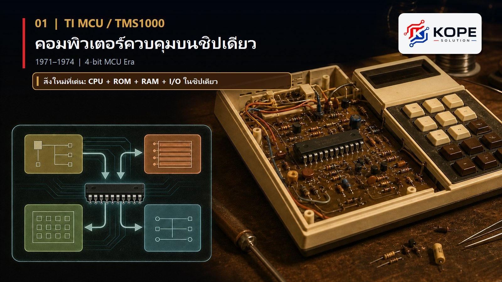

*ภาพประกอบเชิงแนวคิดของบริบทการใช้งานและนวัตกรรม ไม่ใช่ภาพผลิตภัณฑ์หรือผังวงจรจริง*

ความสำคัญของช่วงนี้ไม่ใช่ clock speed แต่คือการลดจำนวนชิ้นส่วนและต้นทุน จนผู้ผลิตสามารถใส่ตรรกะที่ตั้งโปรแกรมได้ลงในเครื่องคิดเลข ของเล่น เครื่องใช้ไฟฟ้า และระบบควบคุมที่ผลิตจำนวนมากได้

ประวัติ “MCU ตัวแรก” มีรายละเอียดเรื่องวันที่ประดิษฐ์ วันที่จดสิทธิบัตร วันที่ประกาศ และวันที่เริ่มจำหน่ายต่างกัน ดังนั้นคำว่า “ยุคแรก” จึงแม่นยำกว่าการตัดสินด้วยปีเพียงตัวเดียว และควรอ่านปีควบคู่กับแหล่งอ้างอิงเสมอ

## 2. Intel MCS-48 / 8048 — MCU เชิงพาณิชย์ยุคบุกเบิก

Intel เปิดตัวตระกูล MCS-48 ในปี 1976 โดย 8048 เป็นสมาชิกที่ได้รับความนิยมสูง ชิปรวม CPU 8-bit, ROM, RAM, timer และ I/O สำหรับงานควบคุมไว้ด้วยกัน และถูกนำไปใช้ในคีย์บอร์ด อุปกรณ์สำนักงาน เครื่องดนตรี และเครื่องใช้ไฟฟ้าหลายประเภท

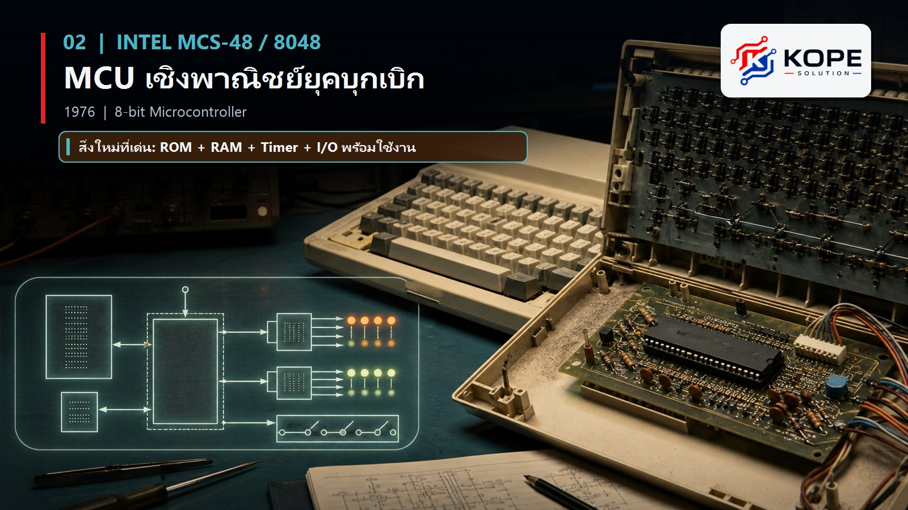

*ภาพประกอบเชิงแนวคิดของบริบทการใช้งานและนวัตกรรม ไม่ใช่ภาพผลิตภัณฑ์หรือผังวงจรจริง*

MCS-48 ช่วยยืนยันว่า MCU ไม่ได้เป็นเพียงชิปทดลอง แต่เป็นแพลตฟอร์มที่ผู้ผลิตสินค้าเชิงพาณิชย์สามารถนำไปใช้ซ้ำในผลิตภัณฑ์หลายรุ่น เรื่องนี้ยังเป็นสะพานสำคัญก่อน Intel พัฒนา MCS-51 หรือ 8051 ในเวลาต่อมา

การเพิ่ม MCS-48 ลงในเส้นเวลาช่วยป้องกันความเข้าใจผิดว่าเรื่องราวเริ่มที่ Z8 หรือ 8051 เพราะก่อนปี 1979–1980 ตลาดมี MCU ที่ถูกใช้งานจริงแล้ว

## 3. Zilog Z8 — Register File และ Register Pointer

Zilog เป็นที่รู้จักจากไมโครโปรเซสเซอร์ Z80 แต่ Z8 ถูกออกแบบให้เป็นไมโครคอนโทรลเลอร์ที่รวม CPU, memory, timer, interrupt และพอร์ต I/O ไว้ในชิปเดียว จุดเด่นของสถาปัตยกรรมคือ register file ที่ใช้จัดการข้อมูลและทรัพยากรภายในได้อย่างยืดหยุ่น

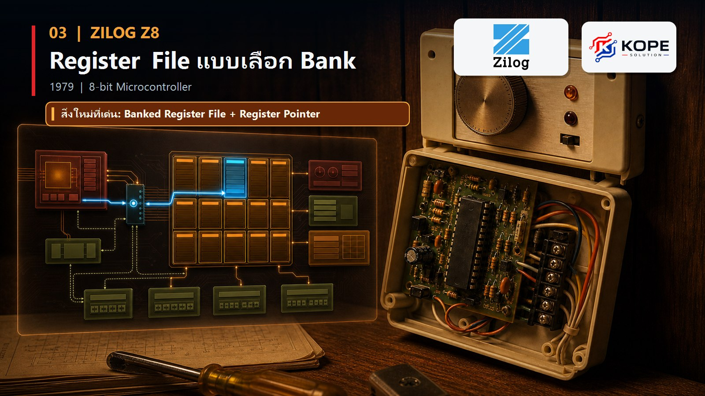

*ภาพรวมหนึ่งเฟรมแสดงทั้งบริบทการใช้งานและแนวคิดสถาปัตยกรรมของ Z8 เป็นภาพประกอบเชิงแนวคิด ไม่ใช่ภาพถ่ายผลิตภัณฑ์หรือผังไดจริง*

Z8 ถูกนำไปใช้ในอุปกรณ์ผู้บริโภค ระบบรักษาความปลอดภัย HVAC และงานควบคุมหลากหลายประเภท จุดที่ควรทำให้เด่นในภาพคือ register file ซึ่งแบ่งเป็นกลุ่ม working registers และใช้ Register Pointer เลือกกลุ่มที่กำลังทำงาน แนวคิดนี้ช่วยให้คำสั่งบางรูปแบบอ้างรีจิสเตอร์ได้กระชับ และช่วยสลับบริบทได้รวดเร็วขึ้น

ข้อควรระวังในการทำสื่อคือชิปที่เขียนว่า `Z8S18020` เป็นสมาชิกของสาย Z180 ไม่ใช่ภาพแทน Z8 รุ่นดั้งเดิม การนำตัวเลข 20 MHz จากชิปดังกล่าวมาใส่ให้ Z8 ปี 1979 จึงทำให้ภาพ ชื่อรุ่น และช่วงเวลาไม่ตรงกัน

## 4. Intel 8051 — สถาปัตยกรรมที่มีอายุยืน

Intel เปิดตัว MCS-51 ในปี 1980 โดย 8051 กลายเป็นสมาชิกที่มีชื่อเสียงที่สุด ตัวชิปรวม CPU 8-bit, program memory, RAM, timer, serial port และ GPIO ไว้ด้วยกัน

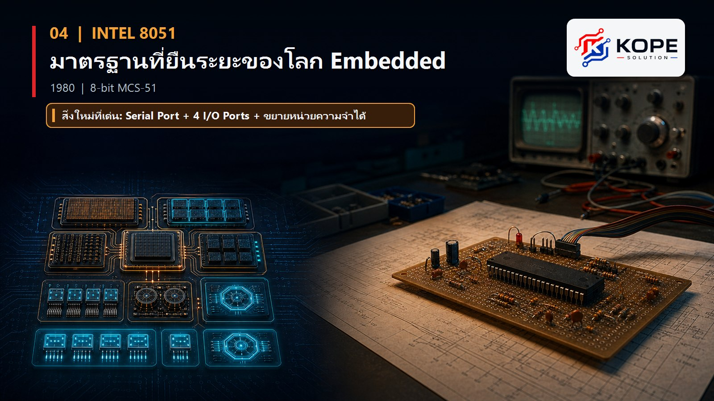

*ภาพรวมหนึ่งเฟรมแสดงทั้งบริบทการพัฒนาและองค์ประกอบสำคัญของ 8051 เป็นภาพประกอบเชิงแนวคิด ไม่ใช่ภาพถ่ายชิปหรือผังไดจริง*

สิ่งที่ทำให้ 8051 มีอิทธิพลคือความยืดหยุ่นและการแพร่หลายของ ecosystem Intel ระบุว่า MCS-51 ขายได้ 100 ล้านชิ้นภายในทศวรรษแรก และถูกใช้ตั้งแต่ระบบเบรก เครื่องบิน เครื่องดนตรี ไปจนถึงของเล่น หลังจากนั้นผู้ผลิตรายอื่นยังคงสร้างชิปที่ใช้สถาปัตยกรรมหรือชุดคำสั่งเข้ากันได้ต่อมาอีกยาวนาน

เรื่องของ 8051 จึงไม่ได้สอนเฉพาะเรื่องความเร็ว แต่สอนว่าความเสถียร เครื่องมือ บุคลากร และฐานซอฟต์แวร์เดิมมีผลต่ออายุของแพลตฟอร์มอย่างมาก

## 5. Motorola 68HC11 — MCU สำหรับงานควบคุม

68HC11 เป็น MCU 8-bit ที่ได้รับความนิยมในงานยานยนต์ อุตสาหกรรม การศึกษา และระบบควบคุม จุดแข็งคือการรวม timer, serial communications, analog-to-digital converter, interrupt และ memory หลายชนิดไว้รอบ CPU

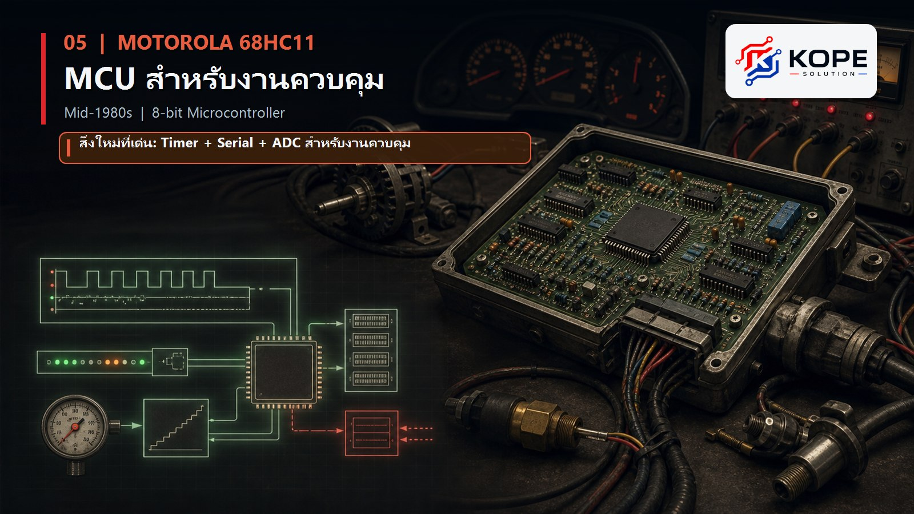

*ภาพประกอบเชิงแนวคิดของบริบทการใช้งานและนวัตกรรม ไม่ใช่ภาพผลิตภัณฑ์หรือผังวงจรจริง*

ความสับสนที่พบบ่อยคือคำว่า “8 MHz” อาจหมายถึงความถี่คริสตัล ไม่ใช่ E-clock ที่ CPU และ bus ใช้เสมอไป ตัวอย่างในเอกสาร M68HC11E แสดงคริสตัล 8 MHz คู่กับ E-clock 2 MHz และคริสตัล 12 MHz คู่กับ E-clock 3 MHz

ดังนั้นสื่อที่เปรียบเทียบ 68HC11 กับ MCU รุ่นใหม่ควรระบุชนิดของ clock และหมายเลขรุ่นย่อยให้ชัดเจน

## 6. TI MSP430 — พลังงานต่ำเป็นคุณสมบัติหลัก

Texas Instruments ระบุว่าอุปกรณ์ MSP430 ตัวแรกออกในปี 1992 ตระกูลนี้ใช้สถาปัตยกรรม 16-bit RISC และให้ความสำคัญกับการใช้พลังงานต่ำ การมีหลาย low-power modes และการตื่นขึ้นมาทำงานอย่างรวดเร็วทำให้เหมาะกับเครื่องมือวัด เซนเซอร์ มิเตอร์ และอุปกรณ์พกพา

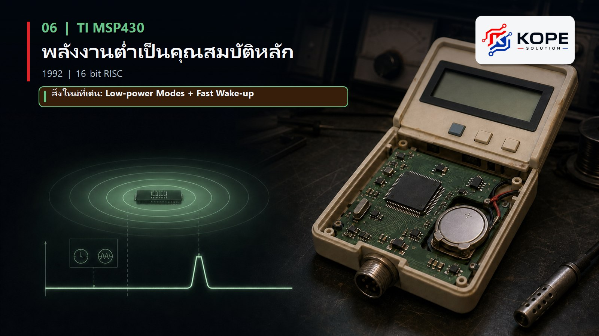

*ภาพประกอบเชิงแนวคิดของบริบทการใช้งานและนวัตกรรม ไม่ใช่ภาพผลิตภัณฑ์หรือผังวงจรจริง*

MSP430G2553 เป็นรุ่นที่ผู้เรียนจำนวนมากรู้จักจาก LaunchPad โดยทำงานได้สูงสุด 16 MHz มี Flash 16 KB และ SRAM 512 bytes อย่างไรก็ตาม ปี 1992 เป็นปีของ MSP430 รุ่นแรก ไม่ใช่ปีเปิดตัว G2553 การ์ดข้อมูลที่วางชื่อ `MSP430G2553` คู่กับปี 1992 โดยไม่อธิบายจึงอาจทำให้เข้าใจผิด

บทเรียนจาก MSP430 คือ MCU ที่เหมาะกับงานไม่ได้จำเป็นต้องมี clock สูงสุด แต่ต้องทำงานที่ต้องการให้เสร็จภายใต้งบพลังงานที่ระบบยอมรับได้

## 7. PIC16F84A — การทดลองที่เขียนโปรแกรมซ้ำได้

PIC16F84A เป็น MCU 8-bit ขนาดเล็กที่ได้รับความนิยมในงานเรียนรู้และโครงการอิเล็กทรอนิกส์ช่วงปลายทศวรรษ 1990 จุดสำคัญคือ Flash program memory และ data EEPROM ซึ่งทำให้ผู้ใช้ทดลอง แก้โปรแกรม และเขียนใหม่ได้สะดวกกว่ายุคที่ชิปแบบ OTP ยังพบได้ทั่วไป

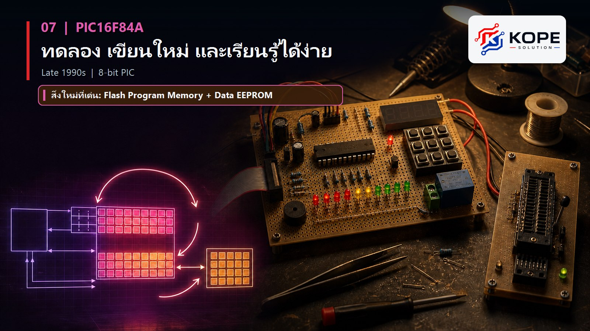

*ภาพประกอบเชิงแนวคิดของบริบทการใช้งานและนวัตกรรม ไม่ใช่ภาพผลิตภัณฑ์หรือผังวงจรจริง*

เอกสารของ Microchip ระบุ clock input สูงสุด 20 MHz, program memory 1,024 words, RAM 68 bytes และ EEPROM 64 bytes ตัวเลขเหล่านี้ดูเล็กมากเมื่อเทียบกับ MCU ปัจจุบัน แต่เพียงพอสำหรับวงจรควบคุม LED, keypad, relay, display และระบบอัตโนมัติขนาดเล็กจำนวนมาก

ความเข้าถึงง่าย เครื่องโปรแกรมที่สร้างเองได้ และตัวอย่างจากหนังสือหรือนิตยสารทำให้ PIC16F84A เป็นประตูเข้าสู่โลก embedded ของผู้เรียนจำนวนหนึ่ง

## 8. Atmel AVR รุ่นแรก — RISC ที่จับคู่กับ Flash

ก่อน ATmega328P จะเป็นที่รู้จักผ่าน Arduino บริษัท Atmel ได้วางรากฐานสถาปัตยกรรม AVR ด้วยรุ่นอย่าง AT90S1200, AT90S2313, AT90S4414 และ AT90S8515 ในช่วงกลางถึงปลายทศวรรษ 1990 จุดเด่นคือสถาปัตยกรรม Harvard, working registers 32 ตัว และคำสั่งจำนวนมากที่ทำงานได้ภายในหนึ่ง clock cycle

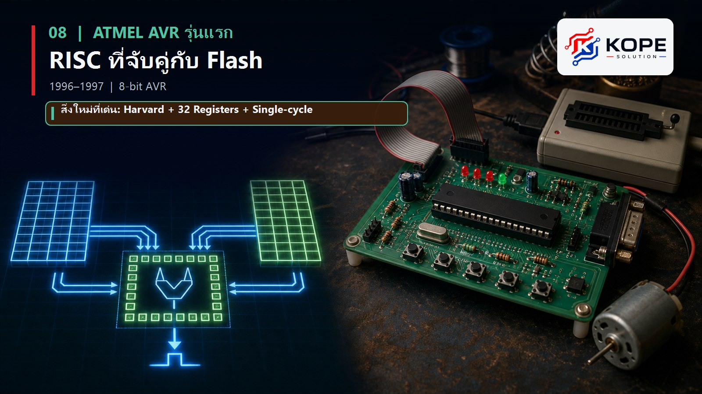

*ภาพประกอบเชิงแนวคิดของบริบทการใช้งานและนวัตกรรม ไม่ใช่ภาพผลิตภัณฑ์หรือผังวงจรจริง*

การจับคู่แกน RISC กับหน่วยความจำ Flash ที่โปรแกรมซ้ำได้ทำให้วงจรทดลองสะดวกขึ้น นักพัฒนาแก้โค้ด คอมไพล์ และเขียนกลับลงชิปได้โดยไม่ต้องเปลี่ยนชิป OTP ทุกครั้ง นี่คือจุดเปลี่ยนคนละเรื่องกับ Arduino: AVR ทำให้ตัวชิปน่าสนใจ ส่วน Arduino ทำให้ทั้งกระบวนการพัฒนาเข้าถึงคนวงกว้าง

การแยก “Atmel AVR รุ่นแรก” ออกจาก “ATmega328P บน Arduino” จึงสำคัญ เพราะช่วยให้เครดิตทั้งนวัตกรรมของสถาปัตยกรรมและอิทธิพลของ ecosystem โดยไม่รวมสองเหตุการณ์ให้เป็นปีเดียวกัน

## 9. Philips LPC2148 — Arm7 และ USB บน MCU

LPC2148 ใช้แกน Arm7TDMI-S แบบ 16/32-bit ทำงานได้สูงสุด 60 MHz มี Flash สูงสุด 512 KB, SRAM, USB 2.0 Full-speed device, ADC, DAC, UART, SPI และ I²C เหมาะกับระบบสื่อสาร เครื่องมือวัด และอุปกรณ์ควบคุมที่ต้องการหน่วยความจำมากขึ้น

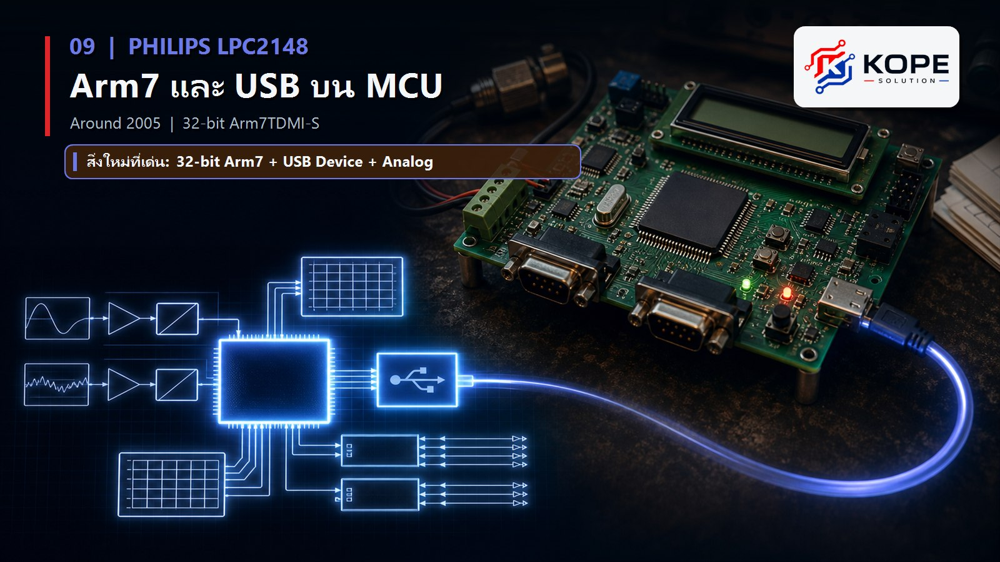

*ภาพประกอบเชิงแนวคิดของบริบทการใช้งานและนวัตกรรม ไม่ใช่ภาพผลิตภัณฑ์หรือผังวงจรจริง*

รายละเอียดทางประวัติศาสตร์ที่ควรเล่าให้ตรงคือ LPC2148 เริ่มต้นในยุค Philips Semiconductors ขณะที่ NXP ก่อตั้งขึ้นจากการแยกธุรกิจเซมิคอนดักเตอร์ของ Philips ในปี 2006 ดังนั้นการใช้ชื่อ “NXP LPC2148” ช่วยให้ค้นผลิตภัณฑ์ปัจจุบันได้ แต่ถ้าเล่าตามช่วงเวลาควรกล่าวว่าเดิมคือ Philips LPC2148

LPC2148 เป็นตัวแทนของช่วงที่นักพัฒนา embedded จำนวนมากเริ่มย้ายจาก MCU 8-bit ไปสู่ Arm 32-bit ก่อนที่ Cortex-M จะกลายเป็นมาตรฐานหลักของตลาด MCU

## 10. STM32F103 — Cortex-M3 และ ecosystem 32-bit

ST เปิดตัว STM32 ในปี 2007 โดย STM32F103 ใช้ Arm Cortex-M3 สูงสุด 72 MHz พร้อม Flash, SRAM, timer, ADC, USB, CAN, UART, SPI และ I²C หลายช่อง

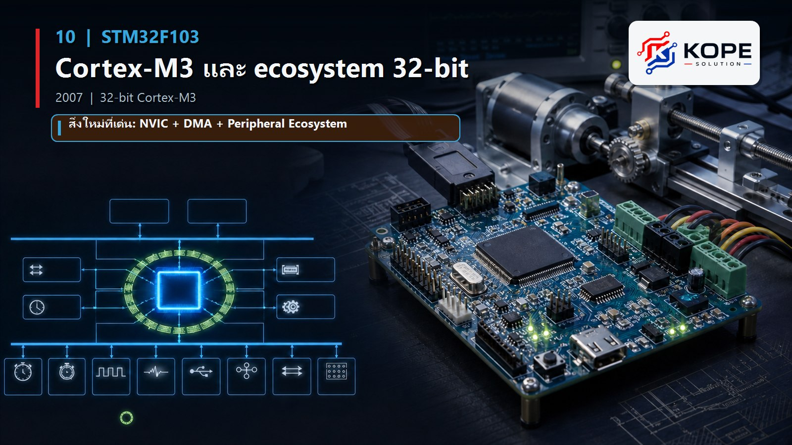

*ภาพประกอบเชิงแนวคิดของบริบทการใช้งานและนวัตกรรม ไม่ใช่ภาพผลิตภัณฑ์หรือผังวงจรจริง*

Cortex-M ถูกออกแบบมาเพื่อไมโครคอนโทรลเลอร์โดยเฉพาะ มีการจัดการ exception และ interrupt ที่เป็นระบบ รองรับการพัฒนาด้วยภาษา C ได้ดี และเปิดทางให้ผู้ผลิตสร้าง MCU หลายระดับบนแกนสถาปัตยกรรมเดียวกัน

ความสำเร็จของ STM32 ไม่ได้มาจาก CPU เท่านั้น แต่รวมถึงจำนวนรุ่น เครื่องมือพัฒนา middleware, development board และชุมชน ภายหลังบอร์ดราคาประหยัดที่เรียกกันว่า Blue Pill ทำให้ STM32F103 เป็นที่รู้จักในกลุ่ม Maker มากขึ้น แม้บอร์ดจากหลายแหล่งจะมีคุณภาพและแหล่งที่มาของชิปแตกต่างกันก็ตาม

## 11. ATmega328P — Arduino เปลี่ยนวิธีเข้าถึงฮาร์ดแวร์

ATmega328P เป็น MCU 8-bit AVR มี Flash 32 KB, SRAM 2 KB และ EEPROM 1 KB ตัวชิปรองรับความถี่สูงสุด 20 MHz แต่ Arduino Uno ใช้งานที่ 16 MHz

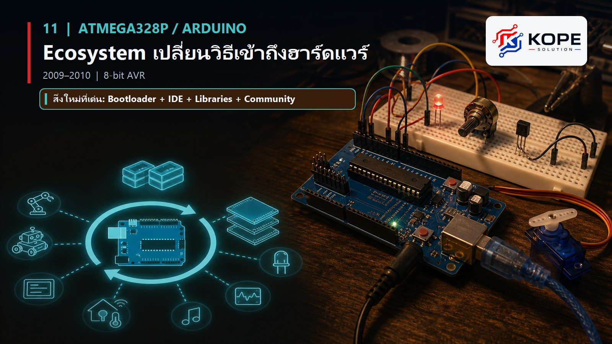

*ภาพประกอบเชิงแนวคิดของบริบทการใช้งานและนวัตกรรม ไม่ใช่ภาพผลิตภัณฑ์หรือผังวงจรจริง*

Arduino ประกาศอัปเกรด Duemilanove ไปใช้ ATmega328 ในเดือนกุมภาพันธ์ 2009 และเปิดตัว Uno ในปี 2010 จุดเปลี่ยนสำคัญจึงไม่ใช่ปีเปิดตัวชิปเพียงอย่างเดียว แต่เป็นการรวมบอร์ดที่ใช้ง่าย bootloader, IDE, API, library, ตัวอย่าง และชุมชนเข้าด้วยกัน

คำสั่งอย่าง `pinMode()` และ `digitalWrite()` ลดกำแพงในการเริ่มต้น ผู้เรียนสามารถทำให้ LED ติดก่อน แล้วจึงค่อยย้อนกลับไปศึกษา register, timer และ interrupt ภายหลัง ATmega328P จึงเป็นตัวอย่างที่ชัดเจนว่า ecosystem สามารถทำให้ MCU หนึ่งรุ่นมีอิทธิพลเกินกว่าสเปกบน datasheet ได้

## 12. Renesas RL78 — 16-bit พลังงานต่ำสำหรับผลิตภัณฑ์จำนวนมาก

Renesas ประกาศตระกูล RL78 ในปี 2010 เพื่อรวมจุดแข็งของสาย 78K และ R8C เข้าด้วยกัน โดยวางตำแหน่งเป็น MCU 16-bit สำหรับงานพลังงานต่ำ ราคาควบคุมได้ และต้องการความน่าเชื่อถือ เช่น เครื่องใช้ไฟฟ้า มิเตอร์ ระบบอุตสาหกรรม และอุปกรณ์ยานยนต์บางประเภท

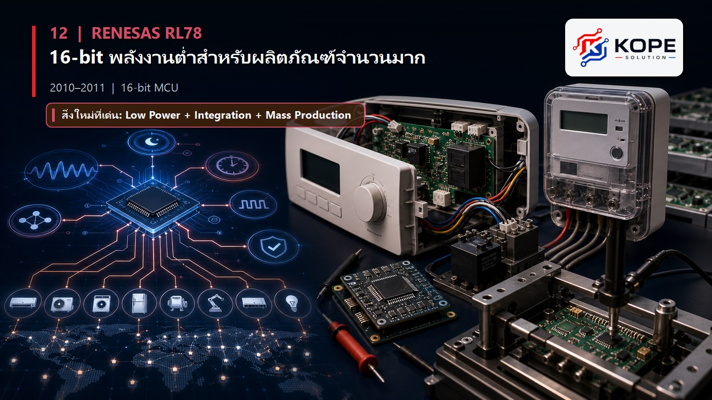

*ภาพประกอบเชิงแนวคิดของบริบทการใช้งานและนวัตกรรม ไม่ใช่ภาพผลิตภัณฑ์หรือผังวงจรจริง*

RL78 เป็นตัวอย่างที่ดีว่าโลก embedded ไม่ได้เปลี่ยนจาก 8-bit ไป 32-bit พร้อมกันทั้งหมด งานที่ผลิตจำนวนมากยังให้ความสำคัญกับกระแสขณะ sleep, เวลา wake-up, peripheral ที่ตรงงาน อายุการจัดจำหน่าย และต้นทุนรวมมากกว่าคะแนนประมวลผลสูงสุด

การใส่ Renesas ลงในเส้นเวลายังช่วยให้ภาพประวัติศาสตร์ไม่เอนเอียงไปทางบอร์ด Maker มากเกินไป เพราะ MCU จำนวนมหาศาลทำงานอยู่ในผลิตภัณฑ์ที่ผู้ใช้ไม่เคยเห็นบอร์ดหรือชื่อชิป

## 13. Nordic nRF51 / nRF52 — Bluetooth LE กลายเป็นส่วนหนึ่งของ MCU

Nordic Semiconductor เปิดตัว nRF51 แบบ single-chip Bluetooth Low Energy ในปี 2012 โดยรวมวิทยุ 2.4 GHz เข้ากับ Arm Cortex-M0 และหน่วยความจำใน SoC เดียว ต่อมา nRF52832 ซึ่งเปิดตัวในปี 2015 ใช้ Cortex-M4F และเพิ่มสมรรถนะ หน่วยความจำ และ peripheral สำหรับอุปกรณ์สวมใส่ เซนเซอร์ไร้สาย อุปกรณ์สุขภาพ และอุปกรณ์เชื่อมต่อพลังงานต่ำ

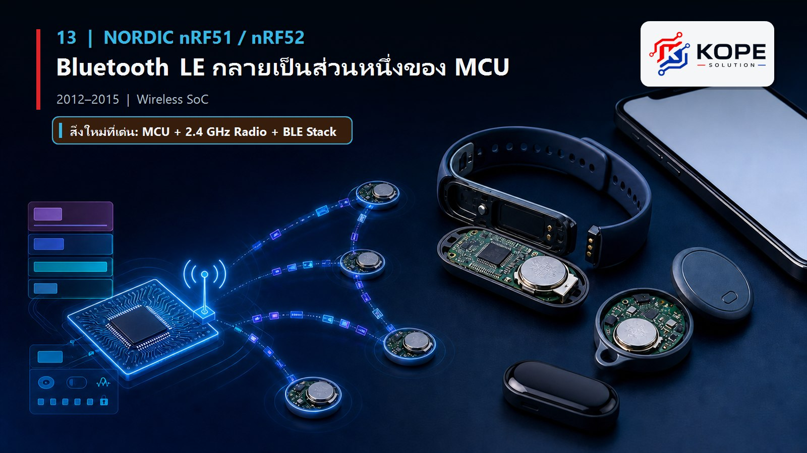

*ภาพประกอบเชิงแนวคิดของบริบทการใช้งานและนวัตกรรม ไม่ใช่ภาพผลิตภัณฑ์หรือผังวงจรจริง*

สิ่งใหม่ที่ควรทำให้เด่นในภาพของ Nordic ไม่ใช่เพียงคำว่า “32-bit” แต่คือการรวม radio, protocol stack และ MCU สำหรับงานแอปพลิเคชันไว้ในชิปเดียว นักพัฒนาจึงสร้างอุปกรณ์ Bluetooth LE ได้โดยไม่ต้องจับคู่ MCU หลักกับโมดูลวิทยุแยกกันเสมอไป

nRF51/nRF52 เป็นตัวแทนของเส้นทาง wireless SoC ที่เน้นแบตเตอรี่และระยะเวลาการทำงาน ต่างจาก ESP32 ซึ่งโดดเด่นด้าน Wi-Fi, Bluetooth และกำลังประมวลผลในต้นทุนที่เข้าถึงง่าย

### ช่วงเชื่อมที่ขาดไม่ได้: ESP8266 (2013–2014)

ก่อนถึง ESP32 ต้องกล่าวถึง ESP8266 เพราะชิปนี้เป็นจุดเปลี่ยนที่ทำให้ Wi-Fi สำหรับงาน IoT มีต้นทุนและจำนวนชิ้นส่วนลดลงอย่างมาก เอกสารทางการของ Espressif มีสองหมุดเวลาที่ควรอ่านร่วมกัน: บริษัทประกาศการผลิต ESP8266 ปริมาณมากในเดือนธันวาคม 2013 ขณะที่หน้า milestones ระบุเดือนพฤษภาคม 2014 เป็นช่วงเปิดตัว ESP8266EX ในฐานะ IoT SoC ตัวแรกของบริษัท ความต่างนี้สะท้อนว่าคำว่า “ปีเปิดตัว” อาจหมายถึงการประกาศผลิต การวางตลาด หรือการทำตลาดในวงกว้าง

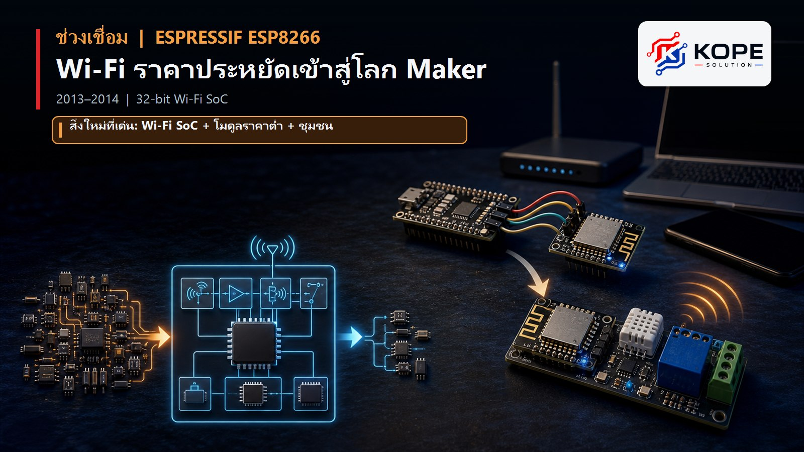

*ภาพประกอบเชิงแนวคิดของการรวมวงจร Wi-Fi และการลดจำนวนชิ้นส่วน ไม่ใช่ภาพผลิตภัณฑ์หรือผังวงจรจริง*

ESP8266 รวม 802.11 b/g/n MAC/PHY, วิทยุ 2.4 GHz, power amplifier, low-noise amplifier, antenna switch, balun และวงจรจัดการพลังงานไว้ใน SoC เดียว จึงใช้ชิ้นส่วนภายนอกน้อยกว่าวิธีประกอบระบบ Wi-Fi แบบเดิม นักพัฒนาสามารถใช้มันเป็นโมดูล Wi-Fi ที่ควบคุมด้วย AT commands หรือรันแอปพลิเคชันบนตัวชิปเองได้

โมดูลราคาประหยัด ชุมชน NodeMCU และเครื่องมือที่เข้ากับแนวทาง Arduino ทำให้ ESP8266 เข้าถึงนักเรียน Maker และผู้พัฒนาผลิตภัณฑ์ขนาดเล็กได้รวดเร็ว ถ้า ESP32 เป็นช่วงที่ “Wi-Fi + Bluetooth + MCU” กลายเป็นแพลตฟอร์มครบเครื่อง ESP8266 ก็คือสะพานที่พิสูจน์ก่อนหน้านั้นว่า MCU เชื่อมอินเทอร์เน็ตในราคาจับต้องได้มีตลาดขนาดใหญ่จริง

## 14. Espressif ESP32 — ระบบไร้สายกลายเป็นคุณสมบัติพื้นฐาน

หลัง ESP8266 เปิดตลาด Wi-Fi SoC ราคาประหยัดแล้ว ESP32 รุ่นดั้งเดิมเปิดตัวในปี 2016 และขยายแนวคิดไปอีกขั้นด้วย Xtensa LX6 แบบ 32-bit มีทั้งรุ่น single-core และ dual-core โดยรองรับความถี่สูงสุด 240 MHz พร้อม Wi-Fi, Bluetooth Classic, Bluetooth Low Energy, SRAM, ADC, DAC, touch sensing และ peripheral สำหรับงานควบคุมจำนวนมาก

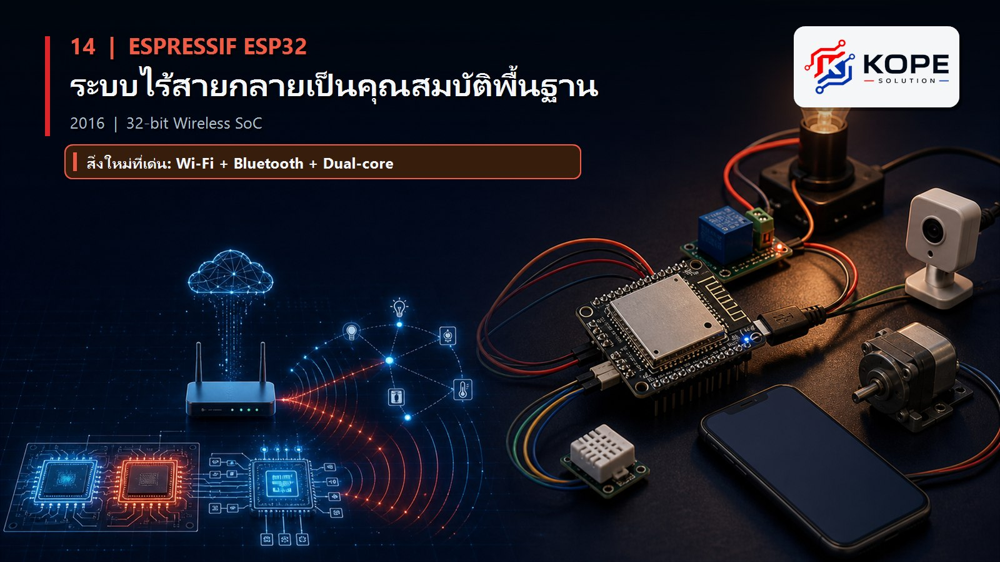

*ภาพประกอบเชิงแนวคิดของบริบทการใช้งานและนวัตกรรม ไม่ใช่ภาพผลิตภัณฑ์หรือผังวงจรจริง*

ก่อน MCU กลุ่มนี้ การเพิ่มอินเทอร์เน็ตอาจต้องใช้ไมโครคอนโทรลเลอร์และโมดูลสื่อสารแยกกัน ESP32 ทำให้ sensor node, MQTT client, web server, smart-home controller และอุปกรณ์ Bluetooth สร้างได้ด้วยโมดูลหลักเพียงตัวเดียวในต้นทุนที่เข้าถึงง่าย

ESP32 จึงเป็นตัวแทนของการเปลี่ยนจาก MCU ที่ “ควบคุมฮาร์ดแวร์ภายในเครื่อง” ไปสู่ MCU ที่เป็นสมาชิกของระบบเครือข่ายตั้งแต่เริ่มออกแบบ

## 15. Raspberry Pi RP2040 — dual-core และ Programmable I/O

Raspberry Pi เปิดตัว RP2040 พร้อม Raspberry Pi Pico ในปี 2021 ตัวชิปมี Arm Cortex-M0+ สองแกนที่ความถี่สูงสุด 133 MHz และ SRAM 264 KB โดยไม่มี Flash ภายในชิป บอร์ดจึงใช้หน่วยความจำ Flash ภายนอก

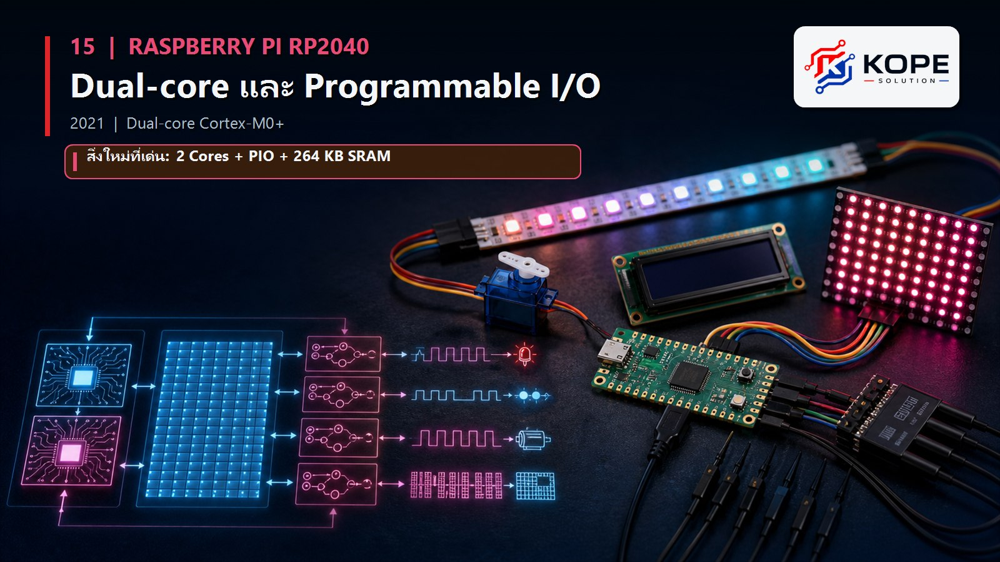

*ภาพประกอบเชิงแนวคิดของบริบทการใช้งานและนวัตกรรม ไม่ใช่ภาพผลิตภัณฑ์หรือผังวงจรจริง*

จุดเด่นคือ Programmable I/O หรือ PIO ซึ่งประกอบด้วย state machines ที่โปรแกรมได้สำหรับรับและสร้างสัญญาณดิจิทัลอย่างแม่นยำ PIO ช่วยทำโปรโตคอลหรือ waveform เฉพาะงานโดยไม่บังคับให้ CPU จัดการทุกขอบสัญญาณ

RP2040 แสดงแนวทางของ MCU สมัยใหม่ที่ผสม CPU หลายแกน หน่วยความจำขนาดใหญ่ และฮาร์ดแวร์เฉพาะทางที่ยืดหยุ่น แทนที่จะพึ่งการเพิ่ม clock CPU เพียงอย่างเดียว

## 16. Nations N32 — ผู้ผลิตใหม่และตัวเลือก Supply Chain

Nations Technologies มีตระกูล N32 ที่ใช้แกน Arm Cortex-M หลายระดับ ครอบคลุมงานควบคุมทั่วไป มอเตอร์ อินเทอร์เฟซแบบ mixed-signal และงานที่ต้องการคุณสมบัติด้านความปลอดภัย รุ่น N32G430 ซึ่งประกาศในปี 2022 ใช้ Cortex-M4F และทำงานได้สูงสุด 128 MHz เป็นตัวอย่างของ MCU สมรรถนะสูงในกลุ่มราคาที่แข่งขันได้

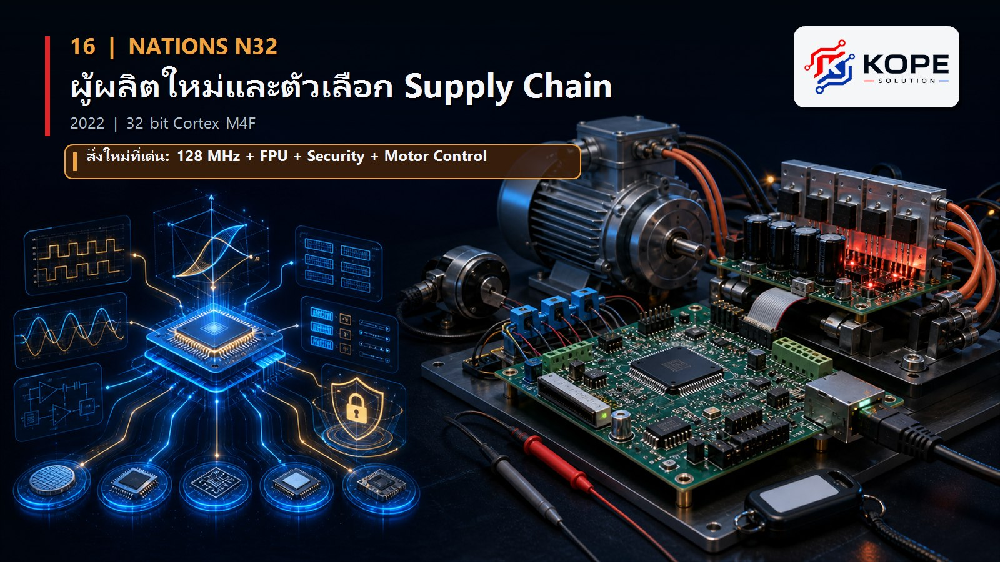

*ภาพประกอบเชิงแนวคิดของบริบทการใช้งานและนวัตกรรม ไม่ใช่ภาพผลิตภัณฑ์หรือผังวงจรจริง*

N32 ไม่ได้มีอายุทางประวัติศาสตร์ยาวเท่า 8051 หรือ AVR แต่ควรปรากฏในบทความฉบับขยาย เพราะสะท้อนความเปลี่ยนแปลงของอุตสาหกรรมปัจจุบัน: นักพัฒนาไม่ได้เลือกชิปจากผู้ผลิตตะวันตกหรือญี่ปุ่นเพียงไม่กี่รายอีกต่อไป และประเด็น supply chain, เครื่องมือ, เอกสาร, community support และความเข้ากันได้ของ peripheral มีน้ำหนักมากขึ้น

N32 จึงทำหน้าที่เป็น “บทเปิดไปสู่ผู้เล่นรุ่นใหม่” มากกว่าจะเป็นข้ออ้างว่าเป็น MCU ที่สำคัญที่สุดรุ่นหนึ่งตลอดกาล มุมมองนี้ยังเปิดทางไปสู่ GigaDevice GD32, WCH CH32, Bouffalo Lab และ RISC-V MCU ซึ่งกำลังเพิ่มความหลากหลายให้ตลาด

## เส้นทางสำคัญที่อยู่นอก 16 บทหลัก

รายชื่อ 16 บทหลักถูกเลือกเพื่อให้เห็นเส้นเรื่องหลักได้ชัดเจน ไม่ได้หมายความว่าตระกูลอื่นมีความสำคัญน้อยกว่า ความจริงแล้วประวัติ MCU แตกแขนงพร้อมกันทั้งงานเครื่องใช้ไฟฟ้า ยานยนต์ อุตสาหกรรม ระบบพลังงานต่ำ ระบบอนาล็อกที่ปรับแต่งได้ และการสื่อสารไร้สาย ตารางนี้จึงทำหน้าที่เป็นแผนที่สำหรับผู้อ่านที่ต้องการศึกษาต่อ

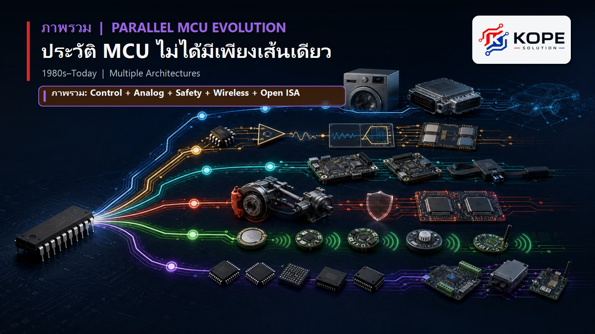

*ภาพประกอบเชิงแนวคิดแสดงเส้นทางพัฒนาแบบขนาน ไม่ได้จัดอันดับผู้ผลิตหรือสถาปัตยกรรม*

| ช่วงเวลาโดยประมาณ | ตระกูลหรือค่าย | สิ่งที่เพิ่มให้ภาพประวัติศาสตร์ |
|---|---|---|
| ปลายทศวรรษ 1980–1990 | Motorola 6805 / 68HC05 / 68HC08 | สะท้อนตลาด 8-bit ปริมาณสูงในเครื่องใช้ไฟฟ้า ยานยนต์ และงานควบคุมต้นทุนต่ำ ซึ่งเดินคู่ขนานกับ 68HC11 |
| ต้นทศวรรษ 2000 | Cypress PSoC 1 ซึ่งปัจจุบันอยู่กับ Infineon | รวม MCU เข้ากับ analog และ digital blocks ที่กำหนดค่าได้ ทำให้คำว่า “peripheral” ไม่ได้หมายถึงวงจรที่ถูกกำหนดตายตัวเสมอไป |
| 2009 เป็นต้นมา | Renesas RX | แสดงเส้นทาง 32-bit ที่ใช้ CPU core ของผู้ผลิตเอง เน้นสมดุลระหว่าง performance, code density, real-time control และ ecosystem ไม่ได้เดินตาม Arm เพียงทางเดียว |
| 2010–2011 เป็นต้นมา | Freescale/NXP Kinetis | เป็นอีกแรงสำคัญของการขยาย Cortex-M4 ไปสู่งานทั่วไป เครื่องมือวัด และอุตสาหกรรม พร้อมเครื่องมือและบอร์ดพัฒนาของตนเอง |
| 2012 เป็นต้นมา | Infineon AURIX / TriCore | เติมมิติของ MCU สำหรับยานยนต์ที่ให้ความสำคัญกับ real-time, multicore, functional safety, lockstep และ hardware security มากกว่าความสะดวกแบบบอร์ด Maker |
| 2013 (Zero Gecko) และตระกูลต่อมา | Silicon Labs EFM32 Gecko | ขยายแนวคิด MCU พลังงานต่ำไปสู่ Cortex-M ด้วย energy modes และ peripheral ที่ทำงานได้โดยไม่ต้องปลุก CPU ตลอดเวลา |
| กลางทศวรรษ 2010 | Atmel/Microchip SAM D21 | เป็นตัวแทน Cortex-M0+ พลังงานต่ำพร้อม USB และ analog peripheral ที่พบในบอร์ดพัฒนาและผลิตภัณฑ์ขนาดเล็กจำนวนมาก |
| กลางทศวรรษ 2010 เป็นต้นมา | TI SimpleLink CC13xx / CC26xx | รวม application core, radio core และ sensor controller สำหรับ Sub-1 GHz, Bluetooth LE, Zigbee, Thread และระบบ multiprotocol |
| 2013–2014 | Espressif ESP8266 | ทำให้ Wi-Fi SoC ราคาประหยัดเข้าสู่ Maker และ IoT ก่อน ESP32 และแสดงพลังของโมดูล ซอฟต์แวร์ และชุมชนที่เติบโตพร้อมตัวชิป |
| 2013 เป็นต้นมา | GigaDevice GD32 | ขยายตลาด MCU ทางเลือกทั้ง Arm Cortex-M และภายหลัง RISC-V พร้อมสะท้อนการแข่งขันด้านราคา ความพร้อมของสินค้า และความหลากหลายของ supply chain |
| ปลายทศวรรษ 2010 เป็นต้นมา | NXP i.MX RT | ทำให้เส้นแบ่ง MCU กับ application processor จางลง ด้วย Cortex-M ความถี่สูง หน่วยความจำขนาดใหญ่ และ interface สำหรับภาพ เสียง Ethernet และงาน real-time |
| ต้นทศวรรษ 2020 | WCH CH32V | แสดงการมาถึงของ MCU RISC-V ราคาต่ำมากสำหรับงานควบคุมทั่วไป ซึ่งช่วยให้สถาปัตยกรรมเปิดเข้าถึงผู้เรียนและสินค้าเชิงพาณิชย์มากขึ้น |
| ปลายทศวรรษ 2010–ต้น 2020 | Bouffalo Lab BL602 / BL604 | รวม RISC-V, Wi-Fi และ Bluetooth LE เป็นอีกแขนงของ wireless SoC นอกตระกูล Espressif และ Nordic |

ตารางนี้ยังไม่ใช่รายชื่อที่ครบทุกตระกูล แต่ช่วยชี้ว่าการศึกษาประวัติ MCU สามารถแยกต่อได้หลายหัวข้อ เช่น MCU ยานยนต์, Wireless MCU, RISC-V MCU, ระบบอนาล็อกที่กำหนดค่าได้ และการแข่งขันของ ecosystem ในตลาด Cortex-M

## สิ่งที่เปลี่ยนไปมากกว่าความเร็ว

เมื่อมองข้ามเวลาประมาณห้าทศวรรษ เราจะเห็นพัฒนาการอย่างน้อยแปดด้าน

1. **หน่วยประมวลผล:** จาก 8-bit ไปสู่ 16-bit, 32-bit และหลายแกน
2. **หน่วยความจำ:** จาก RAM หลักสิบหรือหลักร้อย bytes ไปสู่ SRAM หลักร้อย kilobytes
3. **Peripheral:** timer, ADC, serial, USB, CAN, DMA และ programmable I/O เพิ่มขึ้น
4. **พลังงาน:** มี clock gating, sleep modes และระบบ wake-up ที่ละเอียดขึ้น
5. **การเชื่อมต่อ:** Wi-Fi และ Bluetooth กลายเป็นส่วนหนึ่งของ MCU หรือโมดูลหลัก
6. **เครื่องมือและชุมชน:** IDE, debugger, library, board และตัวอย่างมีผลต่อการเลือกใช้งานมากพอ ๆ กับตัวชิป
7. **ความปลอดภัย:** secure boot, cryptographic accelerator และการปกป้อง key กลายเป็นข้อกำหนดสำคัญ
8. **Supply chain:** อายุผลิตภัณฑ์ แหล่งจัดซื้อ เอกสาร และผู้ผลิตทางเลือกมีผลต่อการออกแบบตั้งแต่ต้น

ดังนั้นคำถามที่เหมาะสมกว่า “ตัวไหน MHz สูงกว่า” คือ “ตัวไหนทำงานที่เราต้องการได้ ภายในข้อจำกัดด้านเวลา พลังงาน ราคา และการบำรุงรักษา”

## เนื้อหาที่เกี่ยวข้อง

- [Microcontroller Fundamentals](../../knowledge/embedded/microcontroller-fundamentals.md)
- [Arduino Uno Embedded Roadmap](../../knowledge/embedded/arduino-uno/index.md)
- [ESP32](../../knowledge/embedded/esp32.md)
- [STM32](../../knowledge/embedded/stm32.md)
- [PIC](../../knowledge/embedded/pic.md)
- [KOPE SOLUTION on YouTube](../../youtube/index.md)

## แหล่งอ้างอิงหลัก

- Texas Instruments, [About TI — company history and innovations](https://www.ti.com/about-ti.html)
- Intel, [MCS-48: The Microcontroller That Changed Everything](https://timeline.intel.com/1976/mcs-48)
- Zilog, [Z8 CPU User Manual](https://zilog.com/docs/um0016.pdf)
- Intel, [Wrinkles and the MCS-51](https://www.intel.com/content/www/us/en/history/virtual-vault/articles/wrinkles-and-the-mcs-51.html)
- NXP, [M68HC11E Family Data Sheet](https://www.nxp.com/docs/en/data-sheet/M68HC11E.pdf)
- Texas Instruments, [MSP430 to MSPM0 MCUs: migration overview and timeline](https://www.ti.com/lit/ml/sprpei0/sprpei0.pdf)
- Texas Instruments, [MSP430G2553 product page](https://www.ti.com/product/MSP430G2553)
- Microchip, [PIC16F84A product page](https://www.microchip.com/en-us/product/PIC16F84A)
- Microchip/Atmel, [AVR: The New World Leader in 8-bit RISC Microcontrollers](https://ww1.microchip.com/downloads/en/DeviceDoc/atmelavr.PDF)
- Microchip, [AVR CPU Core — Harvard architecture and 32 working registers](https://onlinedocs.microchip.com/oxy/GUID-0EC909F9-8FB7-46B2-BF4B-05290662B5C3-en-US-12.1.1/GUID-58665E03-55DB-4291-ADAA-2E3A8C9CB261.html)
- NXP, [LPC2148 product page](https://www.nxp.com/products/LPC2148FBD64)
- NXP, [NXP history](https://www.nxp.com/company/about-nxp/history%3ANXP-HISTORY)
- STMicroelectronics, [STM32F103C8 product page](https://www.st.com/en/microcontrollers-microprocessors/stm32f103c8)
- STMicroelectronics, [Arm 32-bit microcontrollers and STM32 history](https://www.st.com/content/st_com/en/arm-32-bit-microcontrollers.html)
- Microchip, [ATmega328P data sheet](https://ww1.microchip.com/downloads/en/DeviceDoc/Atmel-7810-Automotive-Microcontrollers-ATmega328P_Datasheet.pdf)
- Arduino, [Duemilanove upgraded to the ATmega328](https://blog.arduino.cc/2009/02/28/arduino-duemilanove-upgraded-to-the-atmega328/)
- Arduino, [History of the Arduino Uno](https://blog.arduino.cc/2021/12/09/one-board-to-rule-them-all-history-of-the-arduino-uno/)
- Renesas, [Introduction of the RL78 Microcontroller Family](https://www.renesas.com/en/about/newsroom/renesas-electronics-introduces-new-rl78-microcontroller-family-deliver-solutions-next-generation-8)
- Nordic Semiconductor, [nRF51 launched in 2012 and the evolution to nRF52](https://www.nordicsemi.com/Nordic-news/2018/06/Powerful-wireless-SoCs-meet-advanced-wearables-demand---Part-1)
- Nordic Semiconductor, [nRF51822 product information](https://www.nordicsemi.com/Products/nRF51822/GetStarted)
- Espressif, [Milestones — ESP8266EX and ESP32 launch history](https://www.espressif.com/en/company/about-us/milestones)
- Espressif, [ESP8266 volume-production announcement](https://www.espressif.com/en/news/espressif-systems-announces-volume-production-integrated-80211bgn-wi-fi-soc)
- Espressif, [ESP32 series comparison](https://docs.espressif.com/projects/esp-idf/en/v4.3.5/esp32/hw-reference/chip-series-comparison.html)
- Espressif, [ESP32 Series Data Sheet](https://documentation.espressif.com/esp32_datasheet_en.pdf)
- Raspberry Pi, [Meet Raspberry Silicon: Raspberry Pi Pico](https://www.raspberrypi.com/news/raspberry-pi-silicon-pico-now-on-sale/)
- Raspberry Pi, [RP2040 specifications](https://www.raspberrypi.com/products/rp2040/specifications/)
- Nations Technologies, [N32 general-purpose MCU family](https://www.nationstech.com/product/general/)
- Nations Technologies, [N32G430 product announcement](https://www.nationstech.com/about/news/product/3364.html)
- NXP, [68HC05B6 8-bit MCU family information](https://www.nxp.com/products/68HC05B6)
- Infineon, [PSoC 1 programmable system-on-chip](https://www.infineon.com/cms/en/product/microcontroller/legacy-microcontroller/legacy-8-bit-16-bit-microcontroller/psoc-1/)
- Renesas, [RX MCU family development concept](https://www.renesas.com/en/products/microcontrollers-microprocessors/rx-32-bit-performance-efficiency-mcus/getting-started/concept)
- NXP, [Kinetis K50 Cortex-M4 MCU family](https://www.nxp.com/products/K50_100)
- Infineon, [Generations of AURIX microcontrollers](https://www.infineon.com/product-information/generations-of-aurix-microcontroller)
- Silicon Labs, [EFM32 Zero Gecko launch](https://news.silabs.com/2013-10-09-Silicon-Labs-Launches-the-Worlds-Most-Energy-Friendly-MCUs-Based-on-the-ARM-Cortex-M0-Core)
- Microchip, [SAM D21/DA1 Cortex-M0+ MCU data sheet](https://ww1.microchip.com/downloads/aemDocuments/documents/MCU32/ProductDocuments/DataSheets/SAM-D21-DA1-Family-Data-Sheet-DS40001882H.pdf)
- Texas Instruments, [SimpleLink low-power wireless MCU SDK and supported protocols](https://www.ti.com/tool/SIMPLELINK-LOWPOWER-SDK)
- GigaDevice, [GD32 MCU history from 2013](https://www.gd32mcu.com/en/detail/402)
- NXP, [i.MX RT crossover MCU series](https://www.nxp.com/products/processors-and-microcontrollers/arm-microcontrollers/i-mx-rt-crossover-mcus%3AIMX-RT-SERIES)
- WCH, [CH32V003 RISC-V MCU reference manual](https://www.wch-ic.com/downloads/CH32V003RM_PDF.html)
- Bouffalo Lab, [BL602/BL604 RISC-V Wi-Fi and Bluetooth LE SoCs](https://en.bouffalolab.com/product/?id=18&type=detail)
