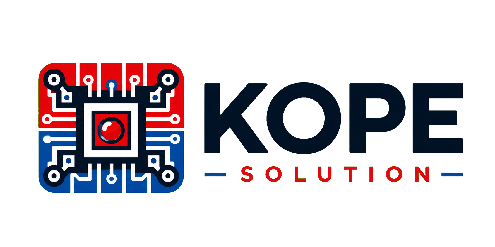

<section class="kope-hero">
  

    
Technical Knowledge · Build in Public · Practical Learning

    <h1>KOPE SOLUTION</h1>
    
พื้นที่รวบรวมความรู้เชิงปฏิบัติ การทดลอง ประสบการณ์พัฒนา และบทเรียนจากโครงการเทคโนโลยี เพื่อเปลี่ยนสิ่งที่เรียนรู้ให้เป็นประโยชน์ที่ส่งต่อได้

    
Keen • Observe • Pioneer • Empower

    
CONTRIBUTE — สร้างประโยชน์ต่อสังคม

    

      <a class="kope-button kope-button--primary" href="knowledge/">Knowledge Hub</a>
      <a class="kope-button" href="youtube/">YouTube</a>
      <a class="kope-button" href="portfolio/">Portfolio</a>
      <a class="kope-button" href="products/">Products</a>
      <a class="kope-button" href="https://github.com/KOPE-SOLUTION/knowledge-hub">GitHub</a>
    

  

  

    
  

</section>

## KOPE SOLUTION

KOPE SOLUTION สร้างพื้นที่กลางสำหรับองค์ความรู้ด้าน Software, Embedded Systems, Electronics, Sensors, Industrial IoT, Data และ AI เนื้อหามุ่งให้ผู้อ่านมองเห็นทั้งหลักการ วิธีคิด เครื่องมือ และกระบวนการพัฒนา โดยจะระบุสถานะของเนื้อหาอย่างตรงไปตรงมาเสมอ

[รู้จัก KOPE SOLUTION และ “โก๊ป” →](about/index.md)

## หมวดความรู้หลัก

  
Hardware + Firmware<h3><a href="knowledge/embedded/">Embedded Systems</a></h3>
Microcontroller fundamentals, Arduino Uno, AVR, ESP32, ESP-IDF, STM32 และ PIC

  
Connectivity<h3><a href="knowledge/protocols/">Communication Protocols</a></h3>
UART, SPI, I2C, RS-485, Modbus, MQTT, Wi-Fi, Bluetooth, LoRa และ RF

  
Systems<h3><a href="knowledge/industrial-iot/">Industrial & IoT</a></h3>
Sensor nodes, gateway architecture, edge computing, monitoring และ offline-first design

  
Measurement<h3><a href="knowledge/sensors/">Sensors & Measurement</a></h3>
การเลือกเซนเซอร์ การสอบเทียบ ความไม่แน่นอน และเครื่องมือวิเคราะห์สัญญาณ

  
Software<h3><a href="knowledge/software-data-ai/">Software, Data & AI</a></h3>
Python, Rust, C/C++, data engineering, visualization, AI, computer vision และ TinyML

  
Learning Path<h3><a href="knowledge/embedded/arduino-uno/">Arduino Uno Roadmap</a></h3>
เส้นทางจาก GPIO ไปสู่ UART, Timer, Interrupt, PWM, ADC, SPI และ I2C

## Featured YouTube content

  

<strong>VIDEO PLACEHOLDER</strong> เพิ่ม Video ID จริงใน `docs/youtube/index.md` ก่อนเปิดใช้งาน embed

  
กำลังจัดทำ<h3>Featured video</h3>
<strong>[ชื่อวิดีโอจริง]</strong>

[สรุปสิ่งที่ผู้ชมจะได้เรียนรู้]

<a href="youtube/">ดูศูนย์รวม YouTube และรายการ Series →</a>

## Featured portfolio projects

  
กำลังจัดทำ<h3><a href="portfolio/projects/arduino-uno-roadmap/">Arduino Uno Embedded Roadmap</a></h3>
โครงหน้าผลงานสำหรับลำดับการเรียนรู้ไมโครคอนโทรลเลอร์

  
กำลังจัดทำ<h3><a href="portfolio/projects/industrial-iot-gateway/">Industrial IoT Gateway</a></h3>
โครงหน้าผลงานสำหรับระบบ gateway และการไหลของข้อมูล

  
กำลังจัดทำ<h3><a href="portfolio/projects/computer-vision-project/">Computer Vision Project</a></h3>
โครงหน้าผลงานสำหรับโจทย์ vision, pipeline และข้อจำกัด

## Latest blog articles

  
ตัวอย่าง · กำลังจัดทำ<h3><a href="blog/posts/sample-embedded-article/">วางแผนบทความ Embedded Systems จากโจทย์ถึงการทดสอบ</a></h3>
ตัวอย่างโครง metadata และ related content สำหรับบทความจริงในอนาคต ไม่มีวันเผยแพร่สมมติ

  
ตัวอย่าง · กำลังจัดทำ<h3><a href="blog/posts/sample-industrial-iot-article/">ออกแบบโครงเรื่อง Industrial IoT Gateway</a></h3>
ตัวอย่างบทความที่แสดงหมวดหมู่ แท็ก สารบัญ และลิงก์เกี่ยวข้อง

[ดู Blog, Categories, Tags และ Archive →](blog/index.md)

## Featured or upcoming products

  
Concept · Placeholder<h3><a href="products/notification-lamp-mini/">Notification Lamp Mini</a></h3>
ตัวอย่างหน้า product showcase เท่านั้น ข้อมูล ราคา สเปก สถานะ และลิงก์ซื้อยังไม่ได้รับการยืนยัน

  
Product catalog<h3><a href="products/">พื้นที่สำหรับผลิตภัณฑ์ในอนาคต</a></h3>
รองรับ IoT Devices, Sensor Nodes, Learning Kits, PCB Modules และหมวดอื่น โดยไม่มี cart หรือ checkout

## GitHub repositories and downloads

  
<h3>GitHub repository</h3>
Source ของเว็บไซต์นี้อยู่ที่ repository ที่ระบุใน Project identity

<a href="https://github.com/KOPE-SOLUTION/knowledge-hub">เปิด KOPE-SOLUTION/knowledge-hub ↗</a>

  
<h3><a href="downloads/">Downloads & resources</a></h3>
พื้นที่สำหรับ firmware, source code, manuals, datasheets, schematics, PCB, 3D files, templates และ datasets

ยังไม่มีไฟล์จริง

## Contact and social links

  
<h3><a href="mailto:kittisak.hanheam@gmail.com">Email</a></h3>
kittisak.hanheam@gmail.com

  
<h3><a href="https://github.com/KOPE-SOLUTION">GitHub</a></h3>
KOPE-SOLUTION profile และ repositories

  
<h3><a href="https://www.youtube.com/@kopesolution">YouTube</a></h3>
ช่อง @kopesolution

  
<h3><a href="https://www.facebook.com/people/KOPE-Solution/61558114805915/">Facebook</a></h3>
KOPE Solution

  
<h3><a href="contact/#line">LINE</a></h3>
ช่องทางสอบถามสินค้าเฟสแรก · รอ LINE OA URL

