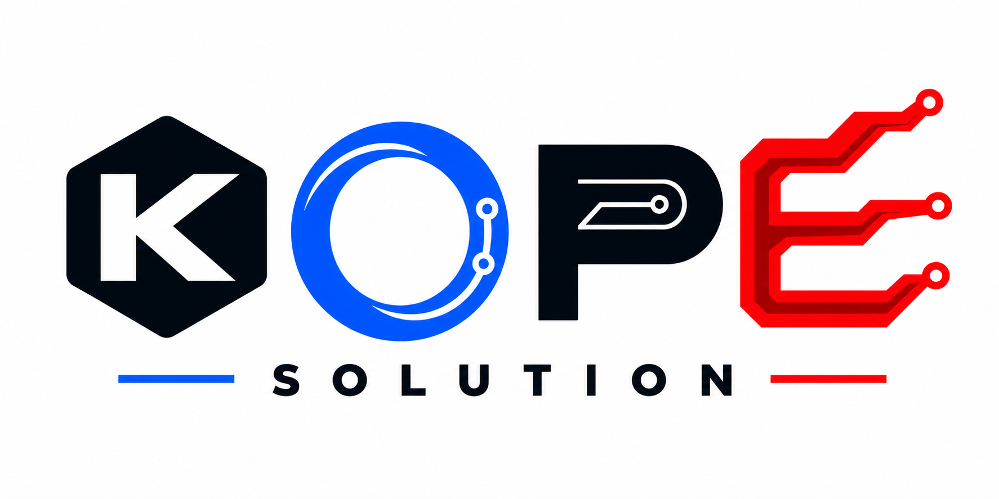
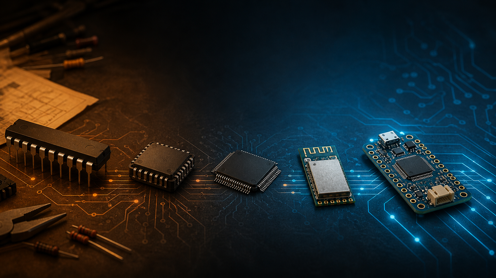

<section class="kope-hero">
  

    
KOPE SOLUTION / ENGINEERING KNOWLEDGE HUB

    <h1>สังเกตให้ลึก สร้างให้เกิดประโยชน์</h1>
    
บันทึกความรู้จากการศึกษา ทดลอง และพัฒนาเทคโนโลยี โดยอธิบายทั้งหลักการ วิธีคิด เครื่องมือ และข้อจำกัดอย่างตรงไปตรงมา

    

      <strong>K</strong> Keen
      <strong>O</strong> Observe
      <strong>P</strong> Pioneer
      <strong>E</strong> Empower
    

    
CONTRIBUTE — สร้างประโยชน์ต่อสังคม

    

      <a class="kope-button kope-button--primary" href="knowledge/">Knowledge Hub</a>
      <a class="kope-button" href="youtube/">YouTube</a>
      <a class="kope-button" href="portfolio/">Portfolio</a>
      <a class="kope-button" href="products/">Products</a>
      <a class="kope-button" href="https://github.com/KOPE-SOLUTION/knowledge-hub">GitHub ↗</a>
    

  

  

    

      
    

    
FIELD NOTE 001 เรียนรู้จากระบบจริง แล้วส่งต่อให้ผู้อื่นนำไปต่อยอดได้

  

</section>

<section class="kope-home-section kope-intent-grid">
  

    
01 / ABOUT THE INTENT

    <h2>ความรู้ที่ดีควรพาคนลงมือทำต่อได้</h2>
  

  

    
KOPE SOLUTION คือพื้นที่รวบรวมความรู้เชิงปฏิบัติ การทดลอง ประสบการณ์พัฒนา และบทเรียนจากโครงการเทคโนโลยี เนื้อหาจะเชื่อมหลักการเข้ากับวิธีคิด เครื่องมือ และข้อจำกัดที่พบระหว่างทาง

    
สิ่งที่ยังไม่ทราบจะระบุว่าอยู่ระหว่างศึกษา สิ่งที่ยังไม่ได้ทดสอบจะไม่ถูกนำเสนอเป็นผลลัพธ์สำเร็จ เพื่อให้ผู้อ่านใช้ข้อมูลต่อได้อย่างมีสติและตรวจสอบได้

    <a class="kope-text-link" href="about/">รู้จัก KOPE SOLUTION และ “โก๊ป” →</a>
  

  

    
<b>K</b><strong>Keen</strong> ถามให้ถึงหลักการ ไม่หยุดอยู่ที่การทำตาม

    
<b>O</b><strong>Observe</strong> วัด สังเกต และทบทวนก่อนสรุป

    
<b>P</b><strong>Pioneer</strong> ทดลองเส้นทางใหม่อย่างมีเหตุผล

    
<b>E</b><strong>Empower</strong> ทำความรู้ให้ผู้อื่นนำไปต่อยอดได้

  

</section>

<section class="kope-home-section">
  

    

02 / KNOWLEDGE INDEX
<h2>เลือกเส้นทางเรียนรู้</h2>

    จากพื้นฐานอิเล็กทรอนิกส์ ไปจนถึงระบบที่เชื่อมต่อกัน
  

  

    <a class="kope-index-item" href="knowledge/embedded/">01<strong>Embedded Systems</strong><small>MCU · Firmware · Hardware</small></a>
    <a class="kope-index-item" href="knowledge/protocols/">02<strong>Communication Protocols</strong><small>UART · Modbus · MQTT · RF</small></a>
    <a class="kope-index-item" href="knowledge/industrial-iot/">03<strong>Industrial & IoT</strong><small>Nodes · Gateway · Edge</small></a>
    <a class="kope-index-item" href="knowledge/sensors/">04<strong>Sensors & Measurement</strong><small>Calibration · Uncertainty · Tools</small></a>
    <a class="kope-index-item" href="knowledge/software-data-ai/">05<strong>Software, Data & AI</strong><small>Python · Data · Vision · TinyML</small></a>
    <a class="kope-index-item" href="knowledge/embedded/arduino-uno/">06<strong>Arduino Uno Roadmap</strong><small>GPIO → ADC → Communication</small></a>
  

</section>

<section class="kope-home-section">
  

    
03 / WATCH & BUILD

    <h2>YouTube ที่มีทางให้ศึกษาต่อ</h2>
  

  

    

      
KOPE SOLUTION ON YOUTUBE

      <h3>ดูแนวคิด เห็นขั้นตอน แล้วกลับมาอ่านรายละเอียด</h3>
      
วิดีโอจะเชื่อมโยงกับบทความ Source code เอกสาร และโครงการที่เกี่ยวข้อง เพื่อไม่ให้การเรียนรู้จบลงเพียงตอนดูวิดีโอ

      

        <a class="kope-button kope-button--primary" href="https://www.youtube.com/@kopesolution?sub_confirmation=1">ติดตามช่อง ↗</a>
        <a class="kope-button" href="youtube/">ศูนย์รวม YouTube</a>
      

    

    

      
หัวข้อที่กำลังจัดเตรียม

      <ol>
        <li>Arduino Uno Embedded Roadmap</li>
        <li>AVR Bare-Metal C</li>
        <li>ESP32 & ESP-IDF</li>
        <li>Sensors, Measurement & IIoT</li>
      </ol>
      <small>จะเพิ่มชื่อวิดีโอ วันที่ และภาพปกเมื่อเนื้อหาพร้อมเผยแพร่จริง</small>
    

  

</section>

<section class="kope-home-section">
  

    

04 / SELECTED WORK
<h2>โครงการที่กำลังเรียบเรียงเป็นผลงาน</h2>

    <a class="kope-text-link" href="portfolio/">ดู Portfolio ทั้งหมด →</a>
  

  

    <a href="portfolio/projects/arduino-uno-roadmap/">01
<strong>Arduino Uno Embedded Roadmap</strong><small>เส้นทางเรียนรู้ไมโครคอนโทรลเลอร์อย่างเป็นระบบ</small>
<em>กำลังจัดทำ</em></a>
    <a href="portfolio/projects/industrial-iot-gateway/">02
<strong>Industrial IoT Gateway</strong><small>สถาปัตยกรรม Gateway และการไหลของข้อมูล</small>
<em>กำลังจัดทำ</em></a>
    <a href="portfolio/projects/computer-vision-project/">03
<strong>Computer Vision Project</strong><small>โครงสร้าง Pipeline และข้อจำกัดของระบบ Vision</small>
<em>กำลังจัดทำ</em></a>
  

</section>

<section class="kope-home-section">
  

    
05 / LATEST FIELD NOTE

    <h2>บทความล่าสุด</h2>
  

  <article class="kope-article-feature">
    
    

      
14 AUG 2026 · EMBEDDED SYSTEMS

      <h3><a href="blog/posts/history-of-iconic-microcontrollers/">ประวัติไมโครคอนโทรลเลอร์: 16 ตระกูลสำคัญจากยุคแรกสู่ Wireless SoC</a></h3>
      
สำรวจเส้นเวลา สถาปัตยกรรม จุดเปลี่ยน และข้อควรระวังในการเปรียบเทียบ clock พร้อมแหล่งอ้างอิงสำหรับศึกษาต่อ

      <a class="kope-text-link" href="blog/posts/history-of-iconic-microcontrollers/">อ่าน Field Note →</a>
    

  </article>
</section>

<section class="kope-home-section">
  

    
06 / PRODUCT DEVELOPMENT

    <h2>ผลิตภัณฑ์ที่เปิดเผยตามสถานะจริง</h2>
  

  

    
CONCEPT / PLACEHOLDER<h3>Notification Lamp Mini</h3>

    
พื้นที่ตัวอย่างสำหรับพัฒนา Product showcase ข้อมูลราคา สเปก สถานะการผลิต และช่องทางสั่งซื้อจะเผยแพร่เมื่อได้รับการยืนยันแล้วเท่านั้น

    <a class="kope-text-link" href="products/notification-lamp-mini/">ดูโครงหน้าผลิตภัณฑ์ →</a>
  

</section>

<section class="kope-home-section">
  

    
07 / OPEN RESOURCES

    <h2>Repository และทรัพยากรสำหรับนำไปศึกษาต่อ</h2>
  

  

    <a href="https://github.com/KOPE-SOLUTION/knowledge-hub">GITHUB / SOURCE<strong>KOPE-SOLUTION/knowledge-hub</strong><small>Source code และประวัติการพัฒนาเว็บไซต์นี้ ↗</small></a>
    <a href="downloads/">DOWNLOADS / RESOURCES<strong>ไฟล์ประกอบและเอกสาร</strong><small>Firmware · Manual · Datasheet · Template →</small></a>
  

</section>

<section class="kope-home-section kope-contact-section">
  

    
08 / CONTACT

    <h2>พูดคุย แลกเปลี่ยน และติดตามงาน</h2>
  

  <nav class="kope-contact-strip" aria-label="ช่องทางติดต่อ KOPE SOLUTION">
    <a href="mailto:kittisak.hanheam@gmail.com">Email ↗</a>
    <a href="https://github.com/KOPE-SOLUTION">GitHub ↗</a>
    <a href="https://www.youtube.com/@kopesolution">YouTube ↗</a>
    <a href="https://www.facebook.com/people/KOPE-Solution/61558114805915/">Facebook ↗</a>
    <a href="contact/#line">LINE <small>รออัปเดต</small></a>
  </nav>
</section>
